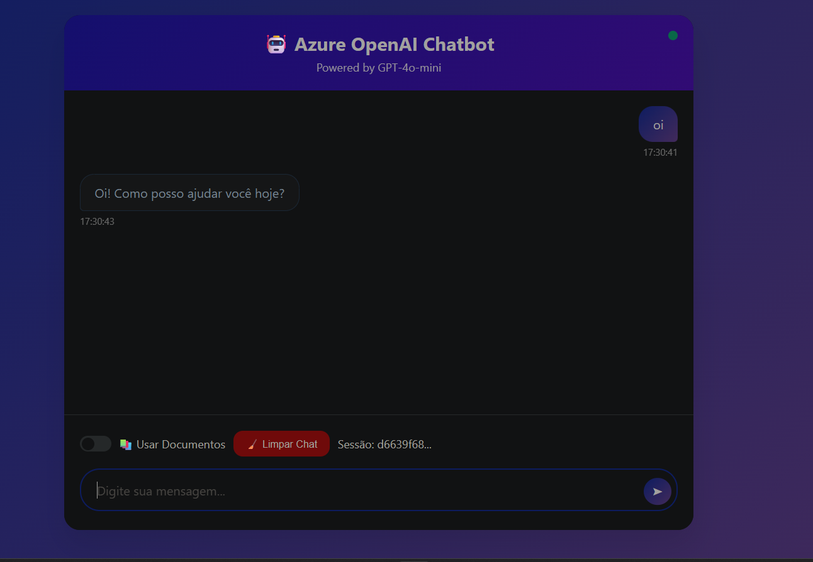

#  Azure AI Foundry

Um projeto que busca colocar em prática o que foi aprendido sobre Azure AI Foundry. Primeiramente foi feito a implementação do modelo escolhido, que foi o GPT 4o Mini. 

### Playground de chat:


### Depois foi feito o upload do artigo para servir de fonte de dados:


### Em seguinte, é testado se realmente estava  funcionando:


### Por último, é conferido se as fontes estavam certas:


#  Azure OpenAI Chatbot

Para futuros projetos, decidi expandir esse projeto, e implantar esse modelo em um chatbot web moderno e interativo integrado com Azure OpenAI, oferecendo conversas com IA e suporte para consulta de documentos PDF através do Azure AI Search.

##  Funcionalidades

*  Chat em tempo real com GPT-4o-mini
*  Integração com documentos PDF via Azure AI Search
*  Configurações personalizáveis (temperatura, max tokens)
*  Gerenciamento de sessões com histórico persistente
*  Interface moderna e responsiva
*  Atalhos de teclado para produtividade
*  Comandos especiais (/help, /stats, /clear)
*  Autenticação segura com Azure

##  Pré-requisitos

* Python 3.8 ou superior
* Conta Azure com Azure OpenAI habilitado
* Azure AI Search (opcional, para usar documentos PDF)

##  Instalação

### 1. Clone o repositório
```bash
git clone https://github.com/Roger-dev-eng/dio-ChatBot.git
cd dio-ChatBot
```

### 2. Instale as dependências
```bash
pip install -r requirements.txt
```

### 3. Configure as variáveis de ambiente

Crie um arquivo `.env` na raiz do projeto:

```env
# Azure OpenAI - Obrigatório
ENDPOINT_URL=https://seu-recurso.cognitiveservices.azure.com/
DEPLOYMENT_NAME=gpt-4o-mini
AZURE_OPENAI_KEY=sua_chave_aqui

##  Configuração

### Obter credenciais Azure OpenAI:

1. Acesse o [Portal do Azure](https://portal.azure.com)
2. Vá para seu recurso **Azure OpenAI**
3. Em **"Keys and Endpoint"**, copie:
   - **Endpoint URL**
   - **API Key**
4. Em **"Model deployments"**, veja o nome do deployment

##  Uso

Após clonar o repositório, clique duas vezes no arquivo 'start_chatbot.bat', e programa abrirá o navegador.
```

##  Estrutura do Projeto
azure-openai-chatbot/<br />
|<br />
├── 📄 start_chatbot.bat --> Inicializa o programa <br />
├── 📄 app.py -->                 Servidor Flask (API + Web)<br />
├── 📄 chatbot_core.py-->         Lógica principal do chatbot<br />
├── 📄 requirements.txt -->       Dependências Python<br />
├── 📄 .env.example        -->   Template de configuração<br />
├── 📄 .gitignore       -->      Arquivos ignorados pelo Git<br />
├── 📄 README.md         -->     Documentação<br />
├── 📄 LICENSE         -->       Licença MIT<br />
│<br />
├── 📂 templates/        -->     Templates HTML<br />
│   └── chat.html         -->   Interface do chat<br />
│<br />
└── 📂 static/              -->  Arquivos estáticos<br />
    ├── css/<br />
    │   └── style.css     -->   Estilos<br />
    └── js/<br />
    │  └── chat.js       -->   JavaScript frontend

#  Configuração Detalhada
### Obtendo Credenciais Azure OpenAI

1. Acesse o Portal do Azure
2. Navegue até seu recurso Azure OpenAI
3. Em "Keys and Endpoint", copie:

    *   Endpoint URL
    * API Key (KEY 1 ou KEY 2)


4. Em "Model deployments", veja o nome do deployment (ex: gpt-4o-mini)

###  Configurando Azure AI Search (Opcional)
#### Para habilitar chat com documentos PDF:

1. Acesse Azure AI Foundry
2. Vá para Chat > Add your data
3. Faça upload dos seus PDFs
4. Configure ou crie um Azure AI Search
5. Copie as credenciais (Endpoint, Key, Index Name)
6. Adicione ao arquivo .env

### Comandos disponíveis:
Digite no chat:

- /help - Mostra todos os comandos disponíveis
- /stats - Exibe estatísticas da sessão atual
- /clear - Limpa o histórico do chat
- /new - Inicia uma nova sessão

##  Exemplo de Uso



##  Dependências

```
openai>=1.12.0
azure-identity>=1.15.0
python-dotenv>=1.0.0
Flask>=2.3.0
flask-cors>=4.0.0
```

#  Conclusão: 
Esta jornada demonstrou como transformar um código básico em uma aplicação completa e profissional.
O processo ensinou muito além da programação: compreendemos o ecossistema Azure, desde conceitos de tokens e custos até implementação de RAG com Azure AI Search.
Essa base sólida abre caminho para projetos mais ambiciosos com IA, sempre mantendo foco em qualidade, segurança e experiência do usuário.

##  Segurança

-  **Nunca commite** o arquivo `.env` 
-  **Mantenha suas chaves privadas**
-  **Use .gitignore** para proteger credenciais

##  Custos

Este projeto usa o modelo GPT-4o-mini, que é econômico:
- **Entrada:** ~$0.15 por 1M tokens
- **Saída:** ~$0.60 per 1M tokens
- **Uso típico:** R$ 5-20/mês para uso pessoal

##  Licença

Este projeto está sob a licença MIT. Veja o arquivo [LICENSE](LICENSE) para detalhes.


