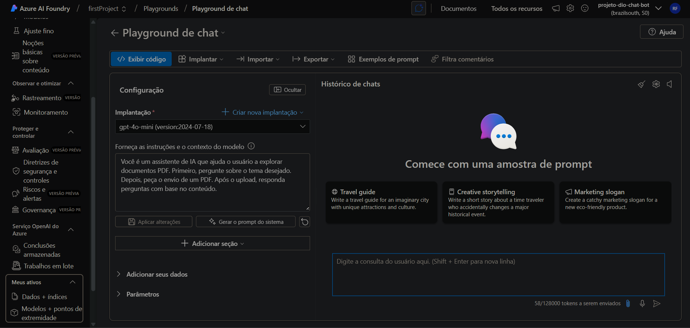
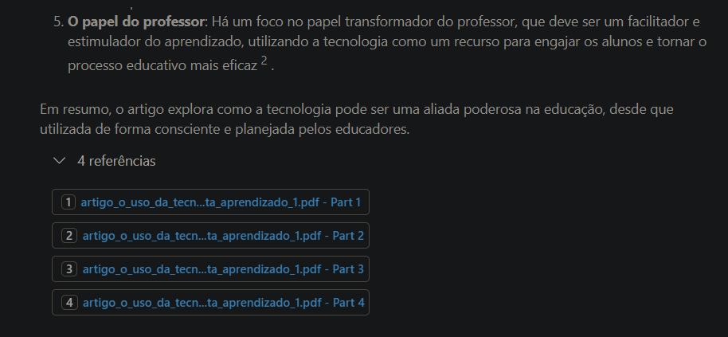

#  Azure AI Foundry

Um projeto que busca colocar em prática o que foi aprendido sobre Azure AI Foundry. Inicialmente foi feito a implementação do modelo escolhido, que foi o GPT 4o Mini. 

### Playground de chat:


### Depois foi feito o upload do artigo para servir de fonte de dados:


### Em seguinte, é testado se realmente estava  funcionando:


### Por último, é conferido se as fontes estavam certas:


#  Azure OpenAI Chatbot

Para futuros projetos decidir expandir esse projeto, e implantar esse modelo em um chatbot interativo em Python que utiliza Azure AI Foundry.

## ✨ Funcionalidades

- 💬 **Conversa contínua** com memória de contexto
- 🎛️ **Comandos interativos** para controlar o bot
- 💾 **Histórico persistente** durante a sessão
- 📄 **Salvamento de conversas** em JSON
- 🔐 **Autenticação flexível** (API Key ou Azure AD)

## 🚀 Instalação

### 1. Clone o repositório
```bash
git clone https://github.com/Roger-dev-eng/dio-ChatBox.git
cd dio-ChatBox
```

### 2. Instale as dependências
```bash
pip install -r requirements.txt
```

### 3. Configure as variáveis de ambiente

Crie um arquivo `.env` na raiz do projeto:

```env
# Azure OpenAI - Obrigatório
ENDPOINT_URL=https://seu-recurso.cognitiveservices.azure.com/
DEPLOYMENT_NAME=gpt-4o-mini
AZURE_OPENAI_KEY=sua_chave_aqui

## 🔧 Configuração

### Obter credenciais Azure OpenAI:

1. Acesse o [Portal do Azure](https://portal.azure.com)
2. Vá para seu recurso **Azure OpenAI**
3. Em **"Keys and Endpoint"**, copie:
   - **Endpoint URL**
   - **API Key**
4. Em **"Model deployments"**, veja o nome do deployment

## 🎮 Uso

Execute o chatbot:
```bash
python chatbot.py
```

### Comandos disponíveis:
- `sair` - Encerra o chatbot
- `limpar` - Limpa o histórico da conversa
- `historico` - Mostra conversas anteriores
- `salvar` - Salva conversa em arquivo JSON
- `ajuda` - Lista todos os comandos

## 📋 Exemplo de Uso

```
🤖 Chatbot Azure OpenAI inicializado!
💡 Digite 'sair' para encerrar, 'limpar' para limpar histórico

👤 Você: Olá! Como você funciona?
🤖 Bot: Olá! Sou um assistente de IA baseado no Azure OpenAI...

👤 Você: salvar
💾 Conversa salva em: conversa_20241225_143022.json
```

## 🛠️ Requisitos

- Python 3.8+
- Conta Azure com Azure OpenAI habilitado

## 📦 Dependências

```
openai>=1.12.0
azure-identity>=1.15.0
python-dotenv>=1.0.0
```

# 🎓 Conclusão: 
Esta jornada demonstrou como transformar um código básico em uma aplicação completa e profissional.
O processo ensinou muito além da programação: compreendemos o ecossistema Azure, desde conceitos de tokens e custos até implementação de RAG com Azure AI Search.
Essa base sólida abre caminho para projetos mais ambiciosos com IA, sempre mantendo foco em qualidade, segurança e experiência do usuário.

## 🔒 Segurança

- ⚠️ **Nunca commite** o arquivo `.env` 
- 🔑 **Mantenha suas chaves privadas**
- 🛡️ **Use .gitignore** para proteger credenciais

## 💰 Custos

Este projeto usa o modelo GPT-4o-mini, que é econômico:
- **Entrada:** ~$0.15 por 1M tokens
- **Saída:** ~$0.60 per 1M tokens
- **Uso típico:** R$ 5-20/mês para uso pessoal

## 🤝 Contribuição

1. Fork o projeto
2. Crie uma branch para sua feature (`git checkout -b feature/nova-feature`)
3. Commit suas mudanças (`git commit -am 'Adiciona nova feature'`)
4. Push para a branch (`git push origin feature/nova-feature`)
5. Abra um Pull Request

## 📄 Licença

Este projeto está sob a licença MIT. Veja o arquivo [LICENSE](LICENSE) para detalhes.


