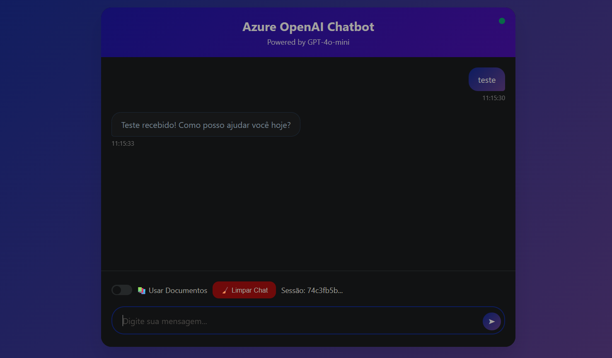

#  Azure AI Foundry

Um projeto que busca colocar em prática o que foi aprendido sobre Azure AI Foundry. Primeiramente foi feito a implementação do modelo escolhido, que foi o GPT 4o Mini. 

### Playground de chat:


### Depois foi feito o upload do artigo para servir de fonte de dados:


### Em seguinte, é testado se realmente estava  funcionando:


### Por último, é conferido se as fontes estavam certas:


#  Azure OpenAI Chatbot

Para futuros projetos, decidi expandir esse projeto, e implantar esse modelo em um chatbot web moderno e interativo integrado com Azure OpenAI, oferecendo conversas com IA e suporte para consulta de documentos PDF através do Azure AI Search.

## ✨ Funcionalidades

* 💬 Chat em tempo real com GPT-4o-mini
* 📚 Integração com documentos PDF via Azure AI Search
* 🎛️ Configurações personalizáveis (temperatura, max tokens)
* 💾 Gerenciamento de sessões com histórico persistente
* 🎨 Interface moderna e responsiva
* ⌨️ Atalhos de teclado para produtividade
* 📊 Comandos especiais (/help, /stats, /clear)
* 🔒 Autenticação segura com Azure
* 🌐 API REST documentada

## 📋 Pré-requisitos

* Python 3.8 ou superior
* Conta Azure com Azure OpenAI habilitado
* Azure AI Search (opcional, para usar documentos PDF)

## 🚀 Instalação

### 1. Clone o repositório
```bash
git clone https://github.com/Roger-dev-eng/dio-ChatBot.git
cd dio-ChatBot
```

### 2. Instale as dependências
```bash
pip install -r requirements.txt
```

### 3. Configure as variáveis de ambiente

Crie um arquivo `.env` na raiz do projeto:

```env
# Azure OpenAI - Obrigatório
ENDPOINT_URL=https://seu-recurso.cognitiveservices.azure.com/
DEPLOYMENT_NAME=gpt-4o-mini
AZURE_OPENAI_KEY=sua_chave_aqui

## 🔧 Configuração

### Obter credenciais Azure OpenAI:

1. Acesse o [Portal do Azure](https://portal.azure.com)
2. Vá para seu recurso **Azure OpenAI**
3. Em **"Keys and Endpoint"**, copie:
   - **Endpoint URL**
   - **API Key**
4. Em **"Model deployments"**, veja o nome do deployment

## 🎮 Uso

Execute o chatbot:
```bash
python chatbot.py
```
Acesse em seu navegador: http://127.0.0.1:5000

## 📁 Estrutura do Projeto
azure-openai-chatbot/<br />
│<br />
├── 📄 app.py -->                 Servidor Flask (API + Web)<br />
├── 📄 chatbot_core.py-->         Lógica principal do chatbot<br />
├── 📄 requirements.txt -->       Dependências Python<br />
├── 📄 .env.example        -->   Template de configuração<br />
├── 📄 .gitignore       -->      Arquivos ignorados pelo Git<br />
├── 📄 README.md         -->     Documentação<br />
├── 📄 LICENSE         -->       Licença MIT<br />
│<br />
├── 📂 templates/        -->     Templates HTML<br />
│   └── chat.html         -->   Interface do chat<br />
│<br />
└── 📂 static/              -->  Arquivos estáticos<br />
    ├── css/<br />
    │   └── style.css     -->   Estilos<br />
    └── js/<br />
    │  └── chat.js       -->   JavaScript frontend

# 🔧 Configuração Detalhada
### Obtendo Credenciais Azure OpenAI

1. Acesse o Portal do Azure
2. Navegue até seu recurso Azure OpenAI
3. Em "Keys and Endpoint", copie:

    *   Endpoint URL
    * API Key (KEY 1 ou KEY 2)


4. Em "Model deployments", veja o nome do deployment (ex: gpt-4o-mini)

###  Configurando Azure AI Search (Opcional)
#### Para habilitar chat com documentos PDF:

1. Acesse Azure AI Foundry
2. Vá para Chat > Add your data
3. Faça upload dos seus PDFs
4. Configure ou crie um Azure AI Search
5. Copie as credenciais (Endpoint, Key, Index Name)
6. Adicione ao arquivo .env

### Comandos disponíveis:
Digite no chat:

- /help - Mostra todos os comandos disponíveis
- /stats - Exibe estatísticas da sessão atual
- /clear - Limpa o histórico do chat
- /new - Inicia uma nova sessão

## 📋 Exemplo de Uso



## 📦 Dependências

```
openai>=1.12.0
azure-identity>=1.15.0
python-dotenv>=1.0.0
Flask>=2.3.0
flask-cors>=4.0.0
```

# 🎓 Conclusão: 
Esta jornada demonstrou como transformar um código básico em uma aplicação completa e profissional.
O processo ensinou muito além da programação: compreendemos o ecossistema Azure, desde conceitos de tokens e custos até implementação de RAG com Azure AI Search.
Essa base sólida abre caminho para projetos mais ambiciosos com IA, sempre mantendo foco em qualidade, segurança e experiência do usuário.

## 🔒 Segurança

- ⚠️ **Nunca commite** o arquivo `.env` 
- 🔑 **Mantenha suas chaves privadas**
- 🛡️ **Use .gitignore** para proteger credenciais

## 💰 Custos

Este projeto usa o modelo GPT-4o-mini, que é econômico:
- **Entrada:** ~$0.15 por 1M tokens
- **Saída:** ~$0.60 per 1M tokens
- **Uso típico:** R$ 5-20/mês para uso pessoal

## 📄 Licença

Este projeto está sob a licença MIT. Veja o arquivo [LICENSE](LICENSE) para detalhes.


